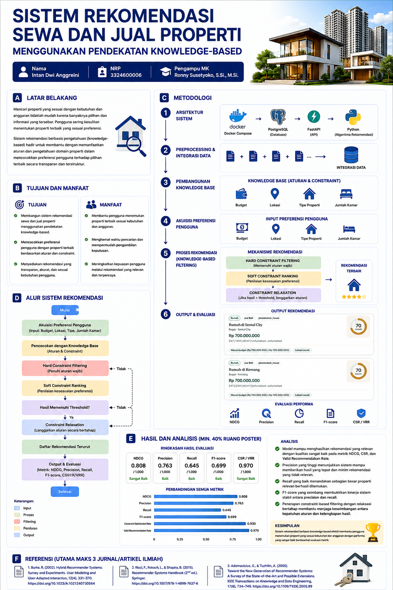

# Sistem Rekomendasi Sewa & Jual Beli Properti Berbasis Knowledge-Based Recommendation



Project ini membangun web app rekomendasi properti berbasis **Knowledge-Based Recommendation** dengan arsitektur:

- **Frontend**: HTML + TailwindCSS + JavaScript
- **Backend API**: FastAPI
- **Database**: PostgreSQL
- **Engine rekomendasi**: Python

Dataset sumber yang didukung:
- Rumah: `jabodetabek_house.csv`, `Combined_Datalist_v1.1.csv`, `yogyakarta_house.csv`
- Apartemen: `travelio2.csv`, `travelio3.csv`, `travelio4.csv`, `travelio5.csv`

## Struktur penting
- `backend/app/services/preprocess.py` → pembersihan, normalisasi, integrasi data
- `backend/app/services/recommender.py` → hard constraint filtering, soft ranking, relaxation
- `backend/app/services/evaluation.py` → NDCG, Precision, Recall, F1-score, CSR/VRR
- `backend/app/static/` → antarmuka web
- `scripts/build_dataset.py` → generate dataset gabungan
- `scripts/evaluate.py` → evaluasi model

## Cara menjalankan dengan Docker
1. Letakkan file CSV asli ke folder:
   `data/raw/`
2. Jalankan:
   ```bash
   docker compose up -d --build
   ```
3. Buka:
   `http://localhost:8000`

## Cara build dataset gabungan manual
Jika ingin membuat ulang dataset hasil preprocessing:
```bash
docker compose exec api python scripts/build_dataset.py --raw-dir /app/data/raw --output /app/data/processed/properties_merged_cleaned.csv
docker compose exec api python scripts/evaluate.py --data /app/data/processed/properties_merged_cleaned.csv --sample-size 100 --top-k 10
```

> Jika container masih memakai image lama (sebelum `PYTHONPATH=/app` ditambahkan)
> dan muncul `ModuleNotFoundError: No module named 'app'`, jalankan sebagai modul
> tanpa perlu rebuild:
> ```bash
> docker compose exec api python -m scripts.build_dataset --raw-dir /app/data/raw --output /app/data/processed/properties_merged_cleaned.csv
> docker compose exec api python -m scripts.evaluate --data /app/data/processed/properties_merged_cleaned.csv --sample-size 100 --top-k 10
> ```

## Panduan penggunaan web app
1. Pilih tipe properti: **Rumah**, **Apartemen**, atau **Semua**.
2. Pilih transaksi: **Jual Beli**, **Sewa**, atau **Semua**.
3. Masukkan budget maksimum.
4. Isi lokasi, kecamatan, minimal kamar, minimal kamar mandi, furnishing, kolam renang, daya listrik, dan luas bila diperlukan.
5. Klik **Cari Rekomendasi**.
6. Hasil ditampilkan dari ranking tertinggi ke terendah.

## Makna proses rekomendasi
Urutan proses yang dipakai:
1. **Hard constraint filtering**  
   Memastikan properti memenuhi syarat utama seperti budget, tipe properti, lokasi, dan jumlah kamar.
2. **Soft constraint ranking**  
   Properti yang lolos disortir berdasarkan kedekatan harga, lokasi, kamar, furnishing, kolam renang, daya listrik, dan luas.
3. **Constraint relaxation**  
   Bila hasil terlalu sedikit, sistem melonggarkan batas secara bertahap.

## Evaluasi
Metode evaluasi yang tersedia:
- **NDCG**
- **Precision**
- **Recall**
- **F1-score**
- **Constraint Satisfaction Rate / Valid Recommendation Rate**

Catatan: karena dataset tidak memiliki label relevansi eksplisit, evaluasi dilakukan secara **query-based offline evaluation** dengan relevansi diturunkan dari kecocokan terhadap constraint pengguna.

## Catatan data
- Dataset rumah digunakan untuk **jual beli**.
- Dataset apartemen Travelio digunakan untuk **sewa**.
- Data dibersihkan dari missing value ekstrem, nilai tidak masuk akal, dan outlier harga/ukuran.

## Endpoint API
- `GET /api/health`
- `GET /api/stats`
- `POST /api/recommend`
- `GET /api/evaluate`
- `POST /api/reload`
